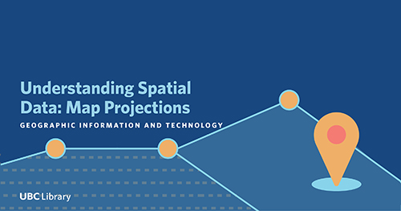

# Map Projections Tutorial
<!-- {: .no_toc } -->

This map [projection tutorial](https://ubc-library-rc.github.io/map-projections/content/exercises.html) was created by Maya Daurio at the UBC Research Commons.  The tutorial has four exercises.  Work through each exercise to get a quick overview of how to work with coordinate systems in ArcGIS Pro.

**1)** What Coordinate System is my Data in?
- Learn how to determine the coordinate system of a layer

**2)** Projecting On-the-Fly
- Learn how ArcGIS Pro handles layers with different coordinate systems

**3)** Project Your Data
- Change the coordinate system of your layer

**4)** Calculating Population Density
- See the material impact of different projections

---
