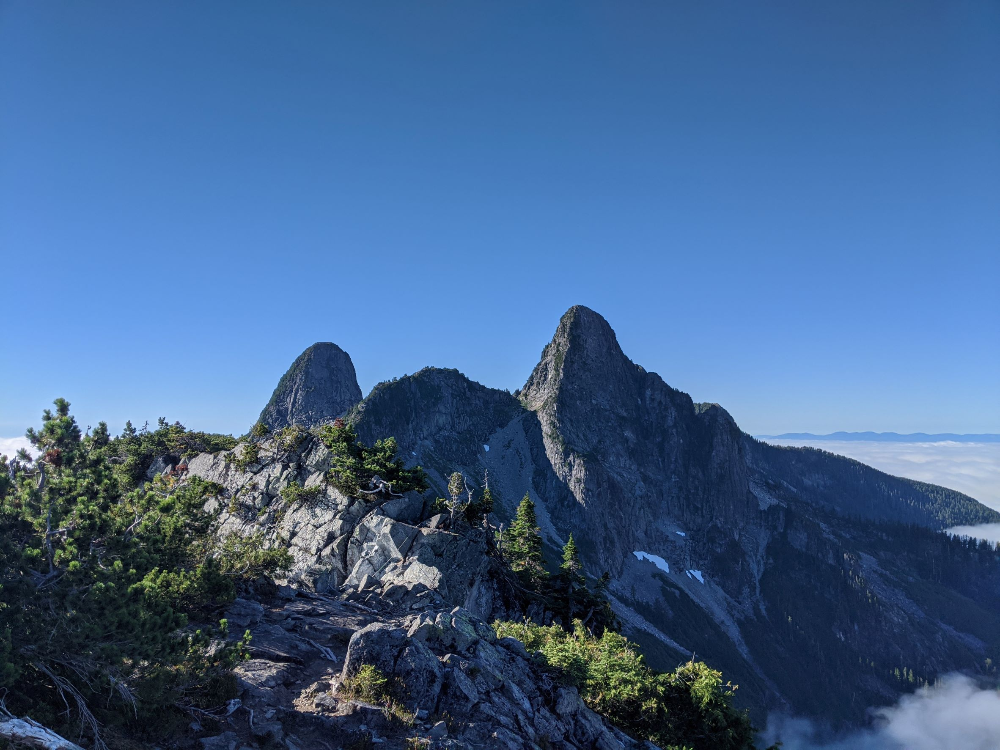

  

    Table of contents
  

  {: .text-delta }
1. TOC
{:toc}

---

# Canadian Colonialism & The First GIS

The British and subsequent Canadian government's grab for power across this landmass was heavily dependent upon cartography.  Maps and surveys were leveraged by those in power exploit resources and oppress Indigenous peoples.

  <iframe src="content/CanadianExpansion.html" title="Processes" scrolling="no" frameborder="0"
    style="border: 0;
   height: 100%;
   left: 0;
   position: absolute;
   top: 0;
   width: 100%;">
   
Your browser does not support iframes.

 </iframe>

<a href="content/CanadianExpansion.html" target="_blank">View slides in new tab</a>

---

# Indigenous Place Names: Countering Colonialism

The lands that comprise Canada have been inhabited for thousands of years and have histories that stretch back well before the colonial era.  Many colonial mapping efforts were centered on erasing Indigenous Peoples and their Histories.  One way they accomplished this was through the use of place names.  A prominent example of this is Ch'ich'iyuy.
* Ch'ich'iyuy is a Skwxwú7mesh word that translates to "The Two Sisters" or "Twin Sisters".  The peak is steeped in tradition and [history](https://www.legendsofvancouver.net/two-sisters-vancouver-bc).  The colonial name "The Lions" completely disregards this history.  The name is based of Heraldry, a system of family crests and symbols from Europe.

## Learning Place Names.

<a href="http://squamishatlas.com/?fbclid=IwAR3JfkUeATF22zPFi9BCo-S6BrOudMQeFSO3_r3iar6JGj0XYf1qTOQ92zE#" target="_blank">The Skwxwú7mesh Atlas</a> is a great resource for learning about Skwxwú7mesh Place Names.

  <iframe src="content/images/squamish_atlas.png" title="Processes" scrolling="no" frameborder="0"
    style="border: 0;
   height: 100%;
   left: 0;
   position: absolute;
   top: 0;
   width: 100%;">
   
Your browser does not support iframes.

 </iframe>

<a href="https://placenamemap.musqueam.bc.ca/?fbclid=IwAR1dWYuotXFkmwJzidy2ayrlPy4NvvnRBuOnUeyoSqsRiZpt5blWhxeFR0I" target="_blank">The xʷməθkʷəy̓əm</a> have a great resource for as well!

  <iframe src="content/images/musqueam_atlas.png" title="Processes" scrolling="no" frameborder="0"
    style="border: 0;
   height: 100%;
   left: 0;
   position: absolute;
   top: 0;
   width: 100%;">
   
Your browser does not support iframes.

 </iframe>

